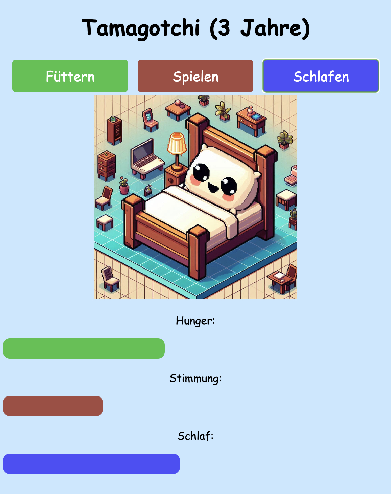

# Anleitung - Tamagotchi App
Ein relativ einfach programmiertes Tamagotchi-Spiel.
Für Anfänger, die programmieren lernen wollen geeignet.

## Preview



## Techstack
JavaScript (valilla), Electron, Node, HTML5, CSS3
## Installation & Start

```
git clone ...
npm install
npm start 
````

## Credits
Diese App wurde estellt von Christian Schade (coffeecat).

